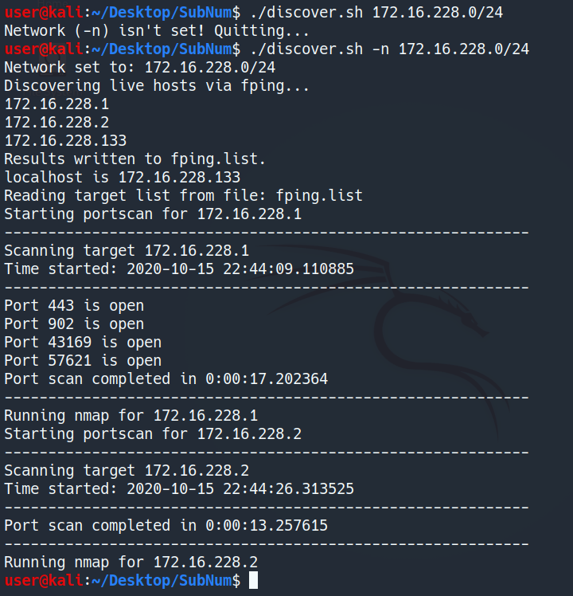

# SubNum
Automatic Subnet enumeration tool.
- Using fping for host discovery
- Using threader3000.py for port discovery
- Using nmap for service and version detection

Usage: discover.sh [options]
Options:
  --help (-h)     Display this text
  --net  (-n)     Set Target network

Example:
- discover.sh -n 192.168.100.0/24

